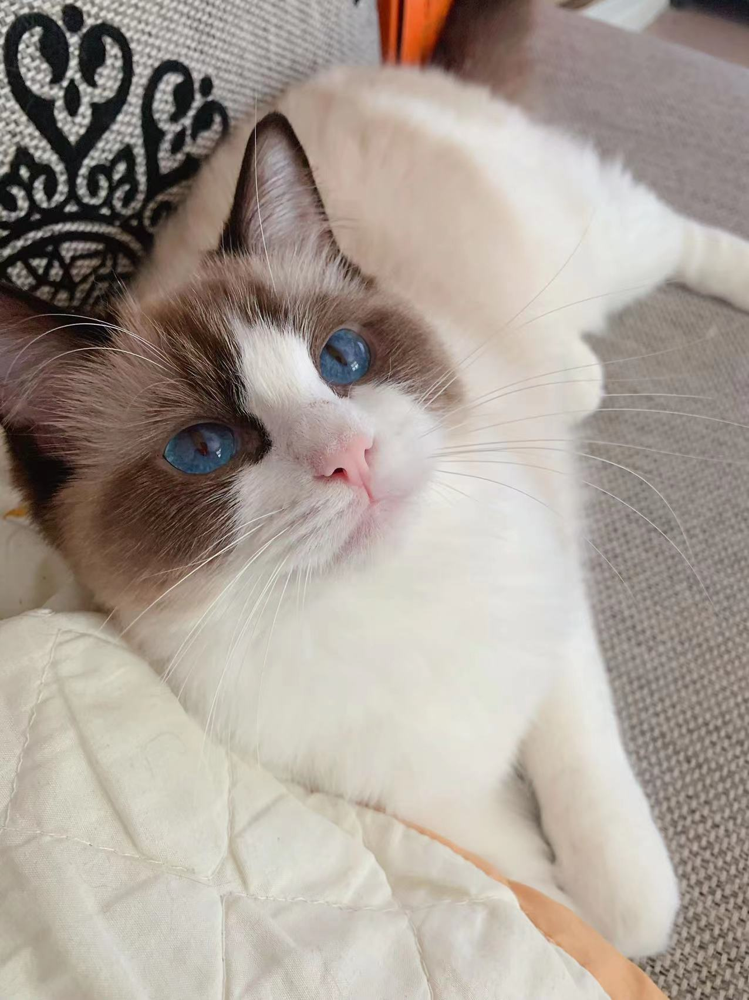
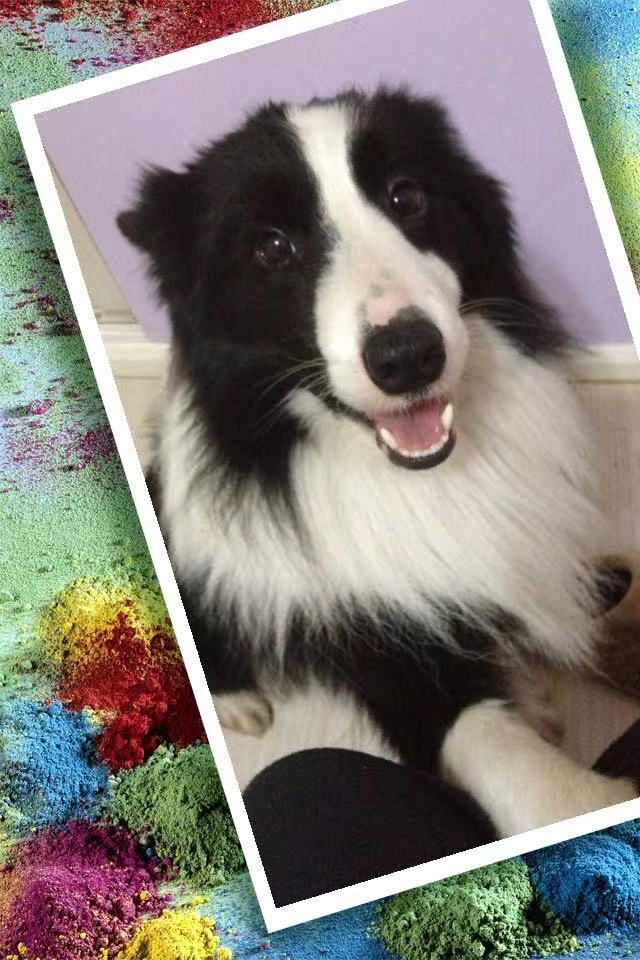

# Welcome!
## My name is Chenfei Yan
*I am from China, Shanghai. I am a third year student major in CS at [UCSD](https://ucsd.edu/). I like plaing vido game, swimming and coding. I want to be a SE in the feature.*

[Here is my picture!](Chenfei.jpg)

[Getting to know me](#getting-to-know-me)

[My Pet's picture](#my-pets-picture)

# Getting to know me:
## My Favourite quote is:
> “what's past is prologue” --Shakespeare
## My Favourite code is:
```
//Java is my fisert language to learn!
Class HelloWorld {
    public static void main() {
        System.out.println("Hello, World!");
    }
}
```
## The class I take this quarter:
- CSE 110
- CSE 101
- CSE 95
- SYN 2
- CSE 130

## The Top 5 things I want to do:
1. Back China to visit parent 
2. Make a lot of money
3. Go switzerland
4. Learn more coding stuff
5. Create a game by myself

## The programming language learn:
- [x] Java
- [x] C++
- [x] C
- [X] SystemVerilog

# My Pet's picture:
## This is my cat, her name is Naitang

## This is my dog, his name is Naonao
